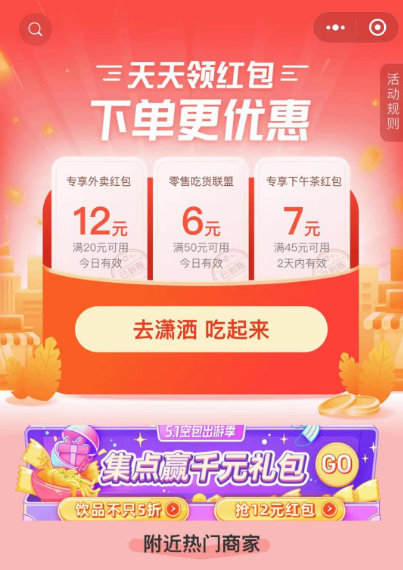

 
 
   <h1 align="center">
  领美团、饿了么外卖隐藏紅包教程
   </h1>
    <h4 align="center">
    隐藏的外卖红包，领了外卖优惠券顿顿不超过10元的点外卖教程！
  </h4> 

#### 项目简介
>建议 加快手速给项目 Star ,分享给你的朋友，让你的朋友一起薅外卖羊毛，不然不知哪天会没了。

#### 生活成本分析
作为打工仔的我们，就算好点的程序员，一般刚刚毕业出来在一线城市干活月薪在8k-10k左右算是比较好的情况，但是算算房租+生活交通+吃喝玩乐+请客吃饭
有时候还要买几件衣服，买双球鞋，一个月下来所剩不多。

#### 购买会员成本分析
我们在美团、饿了么上购买月卡15块6张5块的红包，看起来我们每一单都能省下5块，但是仔细算算，将我们的15的成本减去，实际我们每单只优惠了2.5块，但一个月有30天，如果我们一个有一半的天数都得点外卖
咋办？问题就在这里。

从我这几天实际使用下来的基本少每天个链接最低都能领取到4块钱的使用红包， 运气好的话，碰到有更大活动可能会有更大的，目前我拿到最大的是12元，这样算算每天至少每个连接是4块一天使用两次，每天至少也能省8块，一个月按照30天算，一个月就能省下来240，
每个月省下来240它不香吗？

#### 案例 demo
01 这是我今天的订单跟领取到优惠卷（运气好领到了一个满20减10优惠券）

02 这是点了一个至尊比萨 一个八寸榴莲比萨（最后原本已经是折扣商品的比萨25元，最后加上包装费只给了15.8块）

#### 获取优惠卷流程
1. 关注 吃货君部落 这个公众号
2. 关注 后会自动弹出美团饿了么小程序优惠链接
3. 直接点击想要购买的平台链接
4. 领取对应优惠
5. 领取优惠后将自动跳到对应平台（美团、饿了么）小程序，直接点餐就行了

#### 优惠卷流程图（为了方便大家领取，我将关注流程画一个简单的图片供大家参考）

